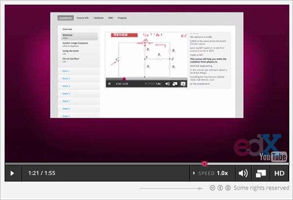

.. _Licensing a Course:

######################################################
Licensing a Course
######################################################

See:

* `Licensing Overview`_
* `License Options`_
* `Set Course Content Licensing`_
* `Set Video Licensing`_
* `The Learner's View of Licenses`_

.. _Licensing Overview:

*************************************
Licensing Overview
*************************************

You can set the license for your course content, as well as for each video in
your course. 

By setting the license, you communicate to students if and how they can reuse
your course content.

.. _License Options:

*************************************
License Options
*************************************

For your course content, and for each video, you can select either:

* All rights reserved
* Creative Commons

.. _All Rights Reserved License:

====================================
All Rights Reserved License
====================================

The All Rights Reserved license indicates to learners that you own the
copyright for course content and videos. Learners cannot reuse or republish
course content and videos.

.. _Creative Commons License:

====================================
Creative Commons License
====================================

The Creative Commons license allows learners to share and reuse course content
and videos.

When you select a Creative Commons license for your course or a video, you
select from four options:

* **Attribution**, which allows others to copy, distribute, display and perform
  your copyrighted work but only if they give credit the way you request. This
  is enabled for all Creative Commons licenses. You cannot clear this option.

* **Noncommercial**, which allows others to distribute, display and perform
  your work -- and derivative works based upon it -- but for non-commercial
  purposes only.

* **No Derivatives**, which allows others to distribute, display and perform
  only verbatim copies of your work, not derivative works based upon it.

* **Share Alike**, which allows others to distribute derivative works only
  under a license identical to the license that governs your work.

See the `Creative Commons website`_ for more information.

.. _Creative Commons website: http://creativecommons.org/

.. _Set Course Content Licensing:

*************************************
Set Course Content Licensing
*************************************

You set the course content license when you :ref:`create a new course <Create a
New Course>`.

After you create a course, you can :ref:`change the course content license <Set
Content Licensing>` in the **Schedule and Details** page.

.. _Set Video Licensing:

*************************************
Set Video Licensing
*************************************

You set the license for each video in the course in the  :ref:`Video Advanced
Options`.

.. _The Learner's View of Licenses:

*************************************
The Learner's View of Licenses
*************************************

Learners see the license you set for course content and videos while taking
your course.

For all course content, learners see the license you set in COMPLETE WHEN LMS
FIXED.

For a video, learners see the license at the bottom right of the video:

A learner can click on the license to get more information.
